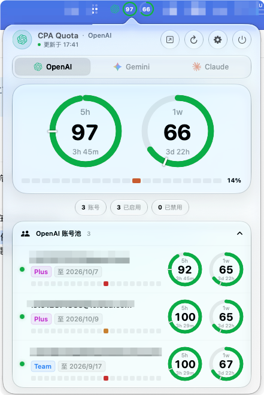
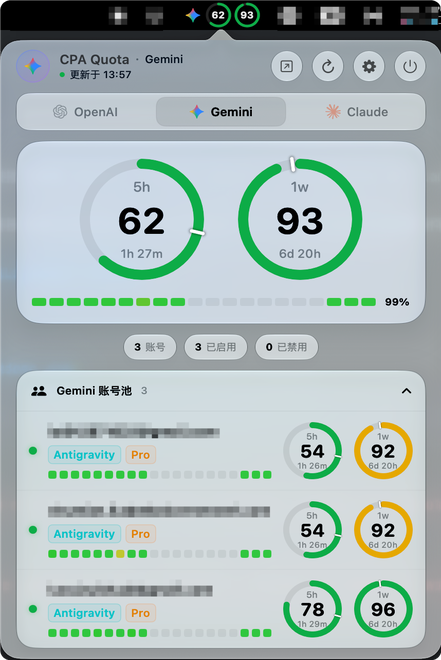

# CPAQuotaBar

[English](README.md) | [简体中文](README_zh.md)

A native macOS menu bar quota monitor designed to inspect remaining limits and reset windows for OpenAI / Codex, Gemini / Antigravity, and Claude accounts directly through the [CLIProxyAPI (CPA)](https://github.com/router-for/CLIProxyAPI) management interface.

Built with native macOS Liquid Glass aesthetics, CPAQuotaBar supports account pool switching, dual-ring quota dials, real-time request statistics, and threshold-based automatic account disabling. The app connects directly to CPA without requiring additional quota plugins or third-party Swift package dependencies.

**Current Version: 0.4.0 · Apple Silicon · macOS 26.2+ · [MIT License](LICENSE)**

## Preview

<p align="center">
  
  
</p>

## Table of Contents

- [Features](#features)
- [System Requirements](#system-requirements)
- [Installation](#installation)
- [Connecting to CPA](#connecting-to-cpa)
- [Auto-Disable & Auto-Recovery](#auto-disable--auto-recovery)
- [Refresh & Caching](#refresh--caching)
- [Data & Security](#data--security)
- [Troubleshooting](#troubleshooting)
- [Updates & Uninstallation](#updates--uninstallation)
- [Feedback & Contributing](#feedback--contributing)
- [License](#license)

## Features

- **Menu Bar Dual Rings**: Real-time status bar rings displaying the primary and secondary quota windows for the active pool.
- **Account Pool Switching**: Switch seamlessly among OpenAI, Gemini, and Claude to view aggregated stats and detailed per-account lists.
- **Privacy Masking**: One-click masking button beside the pool title to conceal sensitive account emails and identifiers for screenshots and demos.
- **Quota & Request Statistics**: View remaining percentages, reset countdowns, account tiers, and recent request success rates.
- **Tier-Weighted Quota Summary**: Pool summary percentage is weighted by actual plan capacity: Plus/Team counts as 1×, Pro 5× as 5×, Pro 20× as 20× (unrecognized tiers fallback to 1×). Account detail rows display their own individual quota percentages.
- **Auto-Disable & Auto-Recovery**: Enforce global or per-account remaining quota thresholds to disable exhausted accounts and automatically restore them upon quota reset.
- **Smart Activity-Based Refresh**: Automatically adjusts refresh intervals based on pool activity; supports instant manual refresh.
- **Native macOS Design**: Crafted with macOS Liquid Glass, seamlessly adapting to both Light and Dark appearances.

| View | Quota Source |
| --- | --- |
| **OpenAI** | OpenAI / Codex accounts in CPA, queried via ChatGPT backend quota endpoints |
| **Gemini** | Antigravity accounts under the Gemini model family |
| **Claude** | Claude OAuth accounts, as well as Antigravity Claude / third-party model groups |

*Note: The same Antigravity account can appear in both Gemini and Claude views. Quotas depend on account tier, subscription type, and upstream responses; not all accounts provide both 5-hour and weekly windows. Plain Gemini API Key accounts are currently not supported.*

## System Requirements

| Item | Requirement |
| --- | --- |
| **Platform** | Apple Silicon Mac (`arm64`), macOS 26.2 or higher |
| **CPA Service** | A running and accessible CLIProxyAPI instance with a valid **Management Key** |

CPAQuotaBar queries accounts and quotas through CPA's management endpoints. Ensure your CPA management dashboard is accessible and authorized for your accounts. Intel Macs are not supported.

## Installation

Download the latest `CPA-Quota-Bar-*-macos-arm64.zip` from [Releases](https://github.com/Joenothing-lst/CPAQuotaBar/releases):

1. Unzip the downloaded archive.
2. Drag `CPA Quota Bar.app` into your macOS `/Applications` folder.
3. On first launch, right-click the app in Finder, select **Open**, and confirm the prompt.
4. The application runs strictly as an agent in the menu bar and does not appear in the Dock.

*The release archive is signed with an ad-hoc local certificate and has not been notarized by Apple. If macOS prevents execution, navigate to **System Settings → Privacy & Security** to allow the application.*

## Connecting to CPA

1. Click the menu bar quota rings and open **Settings**.
2. Enter your CPA root address, e.g. `http://127.0.0.1:8317` (local) or `https://cpa.example.com` (remote).
3. Provide your CPA **Management Key** (*not a standard model API key*).
4. Click **Test Connection** to confirm connectivity to the account list.
5. Review auto-disable preferences, quota thresholds, and refresh frequencies, then click **Save**.

**Auto-disable is enabled by default with a 10% remaining quota threshold.** If you only wish to observe quotas without modifying account status, disable this option prior to saving.

Do not append `/management.html`, `/v0/management`, or URL fragments to the address. For remote connections, HTTPS is strongly recommended, and your reverse proxy must forward the entire `/v0/management/` path.

## Auto-Disable & Auto-Recovery

When enabled, the app scans each account during pool refreshes: if any valid quota window drops to or below the configured threshold and has a future reset timestamp, the account credential is automatically disabled via CPA.

- When multiple windows breach the threshold, the latest reset timestamp is selected.
- The app only restores accounts that were automatically disabled by CPAQuotaBar itself; accounts manually disabled by the user are never modified.
- Windows without valid quota figures or valid future reset dates will not trigger auto-disable.
- Auto-recovery requires the app to remain running, CPA to be reachable, and the corresponding pool to be refreshed.
- Disabling an Antigravity credential affects both its Gemini and Claude model bindings.

### Per-Account Threshold Overrides

In Settings under **Account Overrides**, specify individual thresholds (`0`–`100`), one rule per line:

```text
account@example.com=5
auth-file.json=15
auth-index=20
```

Accounts without custom rules inherit the global threshold.

### Disabling Automatic Management

If you turn off auto-disable in Settings and save, the app will attempt to re-enable all managed accounts in the current pool. If multiple pools were monitored, switch to each pool and refresh once before quitting or clearing preferences.

## Refresh & Caching

| Setting | Default | Description |
| --- | --- | --- |
| **Active Refresh** | `1m` | Used when the current pool has recent requests or the popup panel is open |
| **Idle Refresh** | `1h` | Used when the current pool has had no activity for an extended duration |
| **Idle Timeout** | `5m` | Time of inactivity required before transitioning from active to idle |

When the popup panel is closed, a lightweight background tick checks pool activity roughly once per minute. Switching pools displays local cache immediately, followed by a debounced query. The manual refresh icon triggers an immediate upstream fetch.

*Note: Complete refreshes query accounts in parallel. Slow networks or large account pools may take several seconds. A 401/403 authentication error automatically halts background polling until settings are updated.*

## Data & Security

- CPAQuotaBar communicates exclusively with your configured CPA instance; CPA handles upstream provider queries.
- The Management Key is stored in macOS `UserDefaults` (**unencrypted, not stored in Keychain**).
- The app queries CPA using `authIndex` references and `$TOKEN$` placeholders; OAuth access tokens are neither downloaded nor stored locally.
- Local preferences retain server addresses, monitor settings, account overrides, recovery holds, and cached quota responses.
- Never share your Management Key, OAuth tokens, credentials, or unmasked account logs in issues, screenshots, or PRs.

The application preferences domain is `me.router-for.cpa-quota-bar`.

## Troubleshooting

| Symptom | Resolution |
| --- | --- |
| `401 Unauthorized` | Verify that the CPA Management Key is correct and test the connection again. |
| `403` / `IP banned` | Ensure remote management is allowed in CPA; if banned due to consecutive failures, pause requests and wait for unban. |
| `404 Not Found` | Ensure CPA supports management APIs and reverse proxies forward the entire `/v0/management/` path. |
| Red Account / Missing Quota | Check if token authorization expired, account type compatibility, or upstream CPA response errors. |
| Window Not Visible | The application lives strictly in the menu bar without a Dock icon; verify space in your menu bar. |

## Updates & Uninstallation

The app automatically checks GitHub Releases upon launch and once daily. Open the **App Update** section in Settings to check manually. When a new version is available, click **Update to vX** to automatically download, verify (SHA-256), install, and restart the app.

For offline environments, manual updates can be downloaded from [Releases](https://github.com/Joenothing-lst/CPAQuotaBar/releases). Overwrite the `.app` bundle in `/Applications`; local preferences will be preserved.

Before uninstalling, make sure to re-enable any managed disabled accounts (see [Disabling Automatic Management](#disabling-automatic-management)), then drag the app to Trash.

## Feedback & Contributing

Issues and pull requests are warmly welcomed via [GitHub Issues](https://github.com/Joenothing-lst/CPAQuotaBar/issues). Please include your macOS version, CPA version, and masked reproduction steps.

## License

This project is licensed under the [MIT License](LICENSE). Third-party service names, icons, and trademarks belong to their respective owners.
